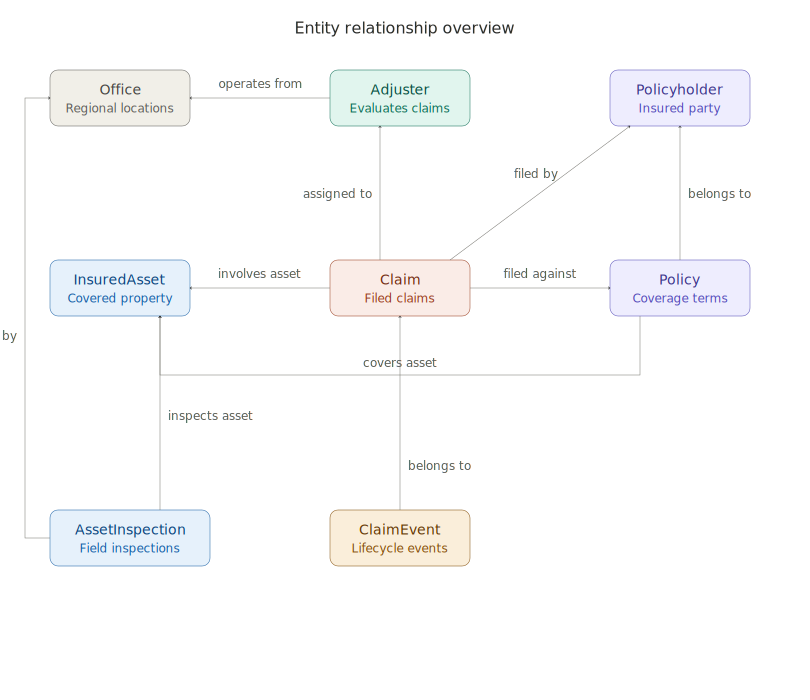

# Insurance Claims Intelligence — Microsoft Fabric

> **Companion repository for the `insurance-ontology` GitHub project.**
>
> **Want to jump straight into setup?** → [Go to Prerequisites](#5-prerequisites)

---

## Table of Contents

1. [Overview](#1-overview)
2. [Business Scenario](#2-business-scenario)
3. [Architecture Overview](#3-architecture-overview)
4. [Repository Structure](#4-repository-structure)
5. [Prerequisites](#5-prerequisites)
6. [Setup Flow](#6-setup-flow)
7. [Notebooks Explained](#7-notebooks-explained)
8. [Semantic Model](#8-semantic-model)
9. [Ontology](#9-ontology)
10. [Eventhouse & Streaming Events](#10-eventhouse--streaming-events)
11. [Sample Questions](#11-sample-questions)
12. [Limitations / Future Work](#12-limitations--future-work)

---

## 1. Overview

Insurance data is fragmented across claims, policies, adjusters, and assets — making cross-entity analysis slow, complex, and often inaccessible.

This project demonstrates how Microsoft Fabric unifies these systems into a single intelligence layer, enabling multi-hop insights across the full claims lifecycle.

With this solution, you can:

- Transform raw insurance records into a fully modeled, queryable knowledge graph
- Stream simulated claim-processing events into an Eventhouse for real-time analysis
- Answer complex questions spanning claims, policies, assets, adjusters, and offices — without cross-system joins
- Leverage Fabric end-to-end: **Lakehouse** for storage, **Semantic Model** (Direct Lake) for analytics, **Eventhouse** for streaming events, **Ontology** for relationship modeling, and **Data Agent** for natural language access

The schema, relationships, and query patterns reflect real-world property & casualty workflows.

---

## 2. Business Scenario

This solution models a **property & casualty insurance** claims operation. The central question it answers:

> *"Given a claim, who filed it, what's insured, who is adjusting it, and what has happened so far?"*

The data model captures the full claims lifecycle through:

- **8 core entities**: Office, Policyholder, InsuredAsset, Adjuster, Policy, Claim, ClaimEvent, AssetInspection
- **10 relationships** linking those entities into a traversable graph
- **5 streaming event types** capturing real-time claim processing activity

The result is a system where complex questions that previously required multiple systems and joins can now be answered in a single query.

---

## 3. Architecture Overview

### Data Layer

- **Lakehouse**: `lh_insurance`
- 8 Delta tables backing all entity types in the semantic model and ontology
- Source data ingested from JSONL files into OneLake

### Semantic Layer

- **Semantic Model**: `InsuranceSM`
- Direct Lake connection — reads directly from Delta tables with no import or duplication
- Defines relationships across 8 entities for Power BI and downstream tooling

### Streaming Layer

- **Eventhouse**: `eh_insurance` with KQL database `insurance_db`
- 5 event tables: `ClaimStatusEvent`, `FraudAlertEvent`, `InspectionEvent`, `PolicyChangeEvent`, `PaymentEvent`
- Events generated by a claim-processing simulator and ingested via the Kusto Python SDK

### Intelligence Layer

- **Ontology**: `InsuranceOntology_AutoGen`
- Entity-relationship graph constructed programmatically via the Fabric REST API
- Maps 8 entities and 10 relationships into a formal ontology structure

### Consumption Layer

- **Data Agent** (optional)
- Natural language querying over the ontology
- Multi-hop relationship traversal without writing code

Conceptually: `Lakehouse → Semantic Model → Ontology → Data Agent` + `Eventhouse (streaming)`

---

## 4. Repository Structure

The repository is organized to separate orchestration, data, modeling, and automation logic for clarity and reusability.

### Core Execution

```
notebooks/
├── 00_demo_setup.ipynb            # End-to-end orchestration
├── 01_load_reference_data.ipynb   # JSONL → Delta tables
├── 02_generate_events.ipynb       # Simulated event streams → Eventhouse
└── 03_create_ontology.ipynb       # Ontology creation via Fabric REST API
```

### Data

```
reference_data/
└── *.jsonl                        # 8 JSONL datasets (all entity types)
```

### Semantic Model

```
semantic_model_project/
└── InsuranceSM/                   # TMDL + PBIP definition files
```

### Supporting Scripts

```
scripts/
├── generate_reference_data.py     # Generates synthetic JSONL data
├── validate_data.py               # FK integrity validation
├── create_insurance_sm.py         # Semantic model deployment
├── create_insurance_eventhouse.py # Eventhouse & KQL database provisioning
└── eventhouse_setup.kql           # KQL table DDL for 5 event tables
```

### Documentation

```
schemas/
├── ontology.md                    # Ontology schema reference
└── event_schemas.md               # Eventhouse event format definitions
sample_queries.kql                 # Example GQL queries for the ontology
```

---

## 5. Prerequisites

- **Fabric workspace** — F16 capacity or higher recommended
- **Contributor access** to the target workspace
- **Preview features** enabled in the Fabric tenant:
  - Ontology
  - Graph
  - Data Agent
  - Copilot / Azure OpenAI
- All notebooks uploaded to the **same workspace** as the Lakehouse and Semantic Model

> There's a full list of prerequisites stated in `00_demo_setup.ipynb` before running.

---

## 6. Setup Flow

The entire environment is provisioned through a single orchestrator notebook:

**`00_demo_setup.ipynb`**

| Step | Action |
|------|--------|
| 1 | Create Lakehouse (`lh_insurance`) |
| 2 | Upload reference data (JSONL → OneLake) |
| 3 | Load data into Delta tables (`01_load_reference_data.ipynb`) |
| 4 | Deploy Semantic Model (`InsuranceSM`) |
| 5 | Create Eventhouse (`eh_insurance`) and KQL database (`insurance_db`) |
| 6 | Generate simulated events (`02_generate_events.ipynb`) |
| 7 | Create Ontology (`03_create_ontology.ipynb`) |

> **Tip:** Every step is idempotent — safe to re-run if something fails partway through.

After the setup notebook completes, your workspace will contain:
- `lh_insurance` — Lakehouse with 8 Delta tables
- `InsuranceSM` — Semantic Model (Direct Lake) with 8 tables
- `eh_insurance` — Eventhouse with 5 KQL event tables
- `InsuranceOntology_AutoGen` — Ontology with 8 entities and 10 relationships

---

## 7. Notebooks Explained

- **`00_demo_setup`** — Master orchestrator. Calls downstream notebooks in sequence and handles workspace configuration. Run this first.
- **`01_load_reference_data`** — Reads JSONL files from `reference_data/`, uploads to OneLake, and loads each dataset into its corresponding Delta table.
- **`02_generate_events`** — Simulates claim-processing activity. Generates 5 event types (status transitions, fraud alerts, inspections, policy changes, payments) with 5 demo scenarios and ingests them into the Eventhouse via the Kusto Python SDK.
- **`03_create_ontology`** — Constructs `InsuranceOntology_AutoGen` programmatically using the Fabric REST API. Defines all 8 entity types and 10 relationships.

> `00_demo_setup` automatically calls the other notebooks — you only need to open and run `00_demo_setup` yourself. All four must be in the **same workspace** or those steps will fail.

---

## 8. Semantic Model

The **`InsuranceSM`** semantic model provides the analytical layer over the Lakehouse.

**Tables (8):**

| Table | Description |
|-------|-------------|
| `offices` | Regional office locations |
| `policyholders` | Individuals or entities holding policies |
| `insured_assets` | Properties or items under coverage |
| `adjusters` | Claims adjusters assigned to evaluate claims |
| `policies` | Policies linking policyholders to coverage |
| `claims` | Filed claims against policies |
| `claim_events` | Timestamped events within a claim's lifecycle |
| `asset_inspections` | Field inspections and appraisals of insured assets |

**Key characteristics:**

- **Direct Lake** mode — no data duplication; reads directly from Delta tables
- All entity relationships defined in `relationships.tmdl`
- Fully functional as a standalone Power BI dataset for reporting and exploration

---

## 9. Ontology

The **`InsuranceOntology_AutoGen`** ontology maps the insurance domain into a formal entity-relationship graph.

**Entity Types (8):**

`Office` · `Policyholder` · `InsuredAsset` · `Adjuster` · `Policy` · `Claim` · `ClaimEvent` · `AssetInspection`

**Relationships (10):**

| From | To | Relationship |
|------|----|-------------|
| Policy | Policyholder | PolicyCoversPolicyholder |
| Policy | InsuredAsset | PolicyCoversAsset |
| Claim | Policy | ClaimUnderPolicy |
| Claim | InsuredAsset | ClaimInvolvesAsset |
| Claim | Adjuster | ClaimAssignedToAdjuster |
| Claim | Policyholder | ClaimFiledByPolicyholder |
| ClaimEvent | Claim | ClaimEventForClaim |
| Adjuster | Office | AdjusterAtOffice |
| AssetInspection | InsuredAsset | InspectionForAsset |
| AssetInspection | Office | InspectionAtOffice |

<br>

<p align="center">
  
</p>

> See [`schemas/ontology.md`](schemas/ontology.md) for full field-level documentation and relationship diagram.

### Creation Options

- **Automated**: Run `03_create_ontology.ipynb` — builds the full ontology via the Fabric REST API
- **Manual**: Define entities and relationships through the Fabric portal UI

### Use Cases

- **Multi-hop queries**: "Which office handles the most claims for assets in Texas?"
- **Relationship traversal**: Navigate from a claim → adjuster → office → related policies
- **Natural language Q&A**: Plain-English questions through the Data Agent

---

## 10. Eventhouse & Streaming Events

The **`eh_insurance`** Eventhouse with KQL database **`insurance_db`** captures real-time claim-processing activity.

**Event Tables (5):**

| Table | Description |
|-------|-------------|
| `ClaimStatusEvent` | Claim lifecycle transitions (initial_review → site_inspection → ... → payment_issued) |
| `FraudAlertEvent` | Automated fraud detection alerts with confidence scoring |
| `InspectionEvent` | Asset inspection scheduling, execution, and damage estimates |
| `PolicyChangeEvent` | Policy modifications during claim processing |
| `PaymentEvent` | Claim settlement payments and disbursements |

**Demo Scenarios (5):**

The event generator (`02_generate_events.ipynb`) injects realistic operational stress patterns:

| Scenario | What Happens |
|----------|-------------|
| Late Resolution | Claim processing exceeds SLA target days |
| Major Loss | High-value claim triggers fraud screening and priority escalation |
| Adjuster Overload | Adjuster approaching maximum concurrent caseload |
| Inspection Due | Field inspection scheduled when claim reaches site_inspection stage |
| Claim Reassignment | Claim transferred to specialist adjuster after major loss |

> See [`schemas/event_schemas.md`](schemas/event_schemas.md) for full event schemas and KQL queries for each scenario.

---

## 11. Sample Questions

These queries demonstrate the cross-entity reasoning the solution supports:

| Question | What the Ontology Uses |
|----------|----------------------|
| *Which claims are currently open for a given policyholder?* | `Policyholder → Policy → Claim` filtered by status |
| *Which adjuster has the most active claims assigned?* | `Adjuster → Claim` with count aggregation |
| *Show all claims for insured assets in a specific state.* | `InsuredAsset → Claim` filtered by location |
| *For a given claim, show the assigned adjuster and their office.* | `Claim → Adjuster → Office` — multi-hop traversal |

Answerable via the Semantic Model (Power BI / DAX), the Ontology (graph traversal), or the Data Agent (natural language).

---

## 12. Limitations / Future Work

- **Data Agent setup** — requires manual configuration in the Fabric portal after ontology creation

---

## Reference

### Video Walkthroughs

These companion videos demonstrate ontology concepts in Microsoft Fabric.

| Video | Description |
|-------|-------------|
| [Designing and Building an Ontology in Microsoft Fabric (uncut)](https://www.youtube.com/watch?v=HrWErMwKjbI) | Full uncut walkthrough of designing and building an ontology end-to-end in Microsoft Fabric |
| [Extending the Ontology with Realtime Data](https://youtu.be/6V9mDSNoXz4) | Walks through binding live Eventhouse data to an ontology and querying it in real time |
| [Integrating the Data Agent with a Multi-source Foundry Agent](https://youtu.be/ognvJ6oKW-M) | Shows how to connect a Data Agent to a Foundry-based multi-agent orchestration pipeline |

---

*Microsoft Fabric Ontology is currently in preview. Features and capabilities may change before general availability.*
